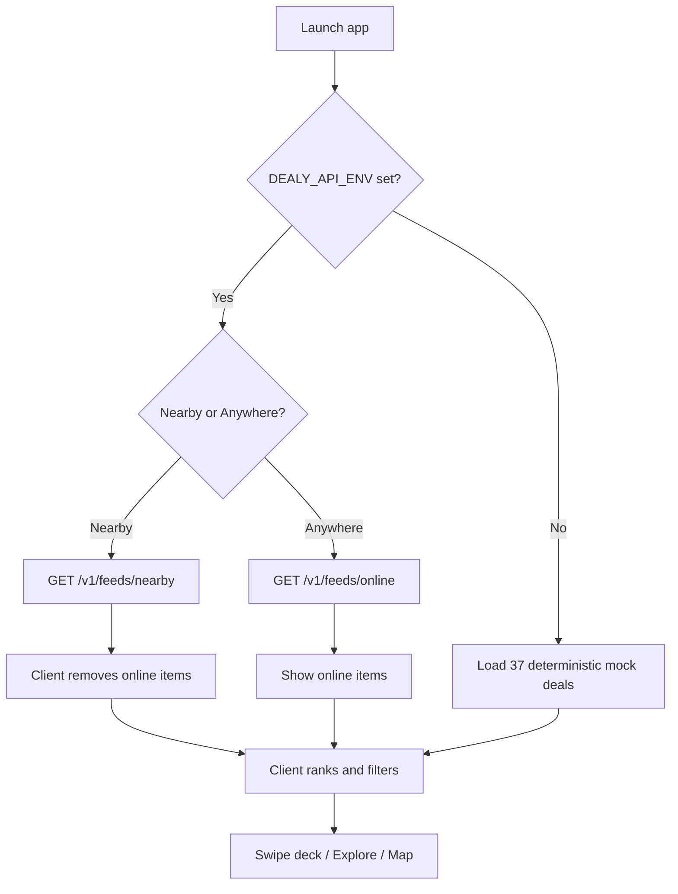
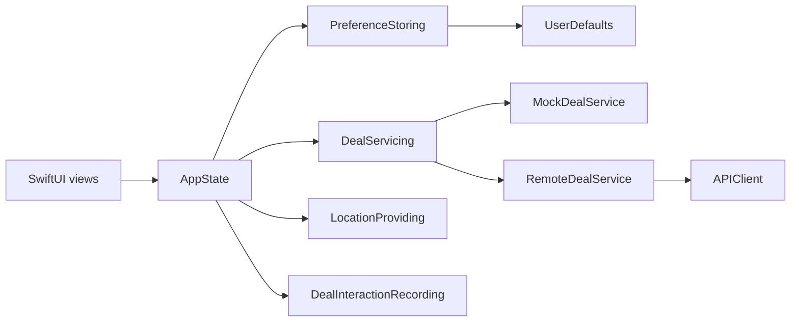
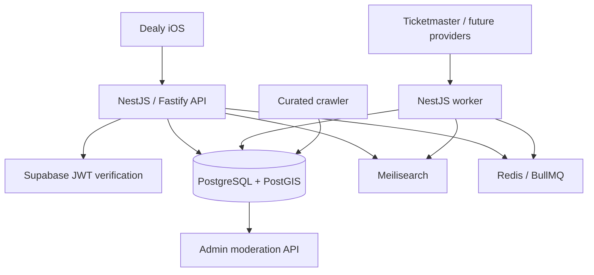
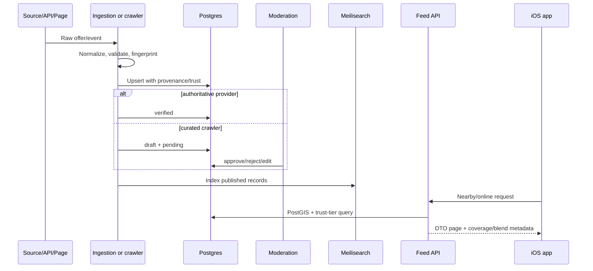

# Dealy Master Overview

> Builder-first product, business, and technical handoff  
> Repository reviewed: `abrar-sarwar/dealy` at commit `0567a4b` on June 23, 2026  
> This document is intentionally candid. It distinguishes code that exists from code that is wired, deployed, supplied with real inventory, and proven with users.

## How to read this document

Dealy has two very different levels of maturity:

1. **The software platform is substantial for an early project.** The repository contains a polished SwiftUI client and a broad NestJS backend covering feeds, PostGIS, auth, user actions, search, ingestion, verification, notifications, recommendations, subscriptions, analytics, administration, and a curated crawler.
2. **The actual business and live product are pre-launch.** There is no resolving production API domain, no Supabase-powered iOS sign-in, no production deployment, no real user base, no working consumer subscription, no operational merchant system, and very little trustworthy deal inventory beyond Ticketmaster events.

Builders should preserve the engineering foundation while radically narrowing near-term execution around one question:

> Can Dealy give a specific Atlanta user a fresh, trustworthy, useful set of nearby savings every week?

Until that answer is yes, adding more platform surface is less valuable than improving inventory, redemption, measurement, and distribution.

---

## 1. Executive Summary

Dealy is an iOS-first, swipe-based deal discovery product intended to help students and value-conscious local shoppers find trustworthy nearby and online offers without searching across merchant apps, coupon sites, weekly circulars, campus channels, event platforms, and social feeds. Its product thesis is that deal discovery can feel less like database search and more like a personalized, location-aware content feed: users swipe through offers, save or watch the useful ones, browse categories and a map, and eventually redeem through merchant or affiliate links. The current repository includes an unusually broad backend foundation, but the live business is not yet operational: the app defaults to mock data, authenticated iOS services are missing, production infrastructure is not deployed, and inventory density is insufficient for a reliable local consumer experience.

### One sentence

Dealy is a location-aware, swipe-first feed for discovering and saving trustworthy local, student, and online deals.

### YC-style description

Dealy is building a personalized deal feed for local commerce, starting with Atlanta students: instead of checking dozens of apps and coupon pages, users swipe through verified or curated offers near them and save the ones they want.

### Investor-style description

Dealy is an early local-commerce discovery platform that combines consumer engagement, structured deal inventory, source verification, and merchant distribution into a mobile feed. The potential business model combines affiliate revenue, sponsored placement, merchant tooling, and consumer premium features, but the company must first prove repeatable inventory density and retention in one launch geography.

### Customer-facing description

Open Dealy, see worthwhile deals around you, swipe past the noise, and save the ones you actually want.

### Current truth in one line

Dealy is a credible prototype and backend platform, not yet a launched or validated marketplace.

---

## 2. Problem Statement

### The core problem

People want to save money, but deal information is fragmented, stale, repetitive, difficult to compare, and often disconnected from where they are or what they care about.

The user does not primarily have a “coupon problem.” The user has an **attention and trust problem**:

- Useful offers are spread across retailer apps, email lists, loyalty programs, weekly ads, affiliate sites, merchant social accounts, campus newsletters, event platforms, and physical signage.
- Search results mix expired coupons, affiliate landing pages, irrelevant national offers, low-quality user submissions, and deals that require unexpected conditions.
- Most products optimize for transaction capture or search intent after the user already knows what they want.
- Local discovery is especially weak. A national coupon platform may know about a large retailer but not a student night, neighborhood happy hour, campus event, or independent merchant promotion.
- The user must evaluate whether an offer is real, current, nearby, worth the trip, and actually cheaper.

### Consumer pain points

- Too many apps and tabs are required to compare savings.
- Coupon codes frequently fail at checkout.
- Large deal feeds are noisy and optimized for volume.
- “Up to” discounts often obscure the actual value.
- Local offers are hard to discover unless the consumer already follows the merchant.
- Location and timing matter, but most coupon databases are not designed around either.
- Users cannot easily maintain one cross-merchant list of saved or watched offers.

### Student pain points

- Students are highly price-sensitive but time-poor.
- Student discounts may require verification, a school email, an ID, a specific day, or a merchant-specific account.
- Campus deals are distributed through informal and inconsistent channels.
- Students frequently move between campus, housing, work, and entertainment districts, making geographic relevance important.
- National student discount networks generally focus on large brands, leaving local campus merchants underrepresented.
- Existing resale marketplaces help with used goods but do not solve recurring local promotions, food, groceries, or events.

### Local deal discovery problems

Local deal supply is not naturally standardized. A merchant may publish an offer as:

- an Instagram story;
- a menu banner;
- a loyalty-app notification;
- a weekly PDF;
- an event listing;
- an email;
- a chalkboard;
- a coupon code;
- a discount applied only during certain hours.

Every source has different fields, expiration semantics, redemption rules, and reliability. Dealy’s backend correctly recognizes that normalizing and re-verifying these records is a core product capability, not a simple scraping task.

### Why existing solutions fail

| Product pattern | Why it helps | Why it does not fully solve Dealy’s target problem |
|---|---|---|
| Browser coupon extensions | Remove checkout friction for online purchases | Activate late in the journey; weak for local discovery and campus offers |
| Cash-back portals | Give consumers measurable post-purchase value | Require merchant participation and purchase attribution; discovery is retailer-led |
| Weekly-ad aggregators | Strong grocery and retail planning | Catalog-oriented, not personalized or entertainment-like |
| Community deal forums | Excellent crowd validation and breadth | High cognitive load; often national and product-centric |
| Local voucher marketplaces | Structured local inventory and redemption | Often require prepaid vouchers and merchant discounting |
| Resale marketplaces | Strong nearby inventory and price negotiation | Peer-to-peer goods, not merchant promotions |
| Merchant loyalty apps | Best source for that merchant’s offers | Fragment the user experience across many apps |

### Why the problem matters

Savings is a high-frequency consumer need, but trustworthy discovery is not solved by simply adding more offers. A product that reduces evaluation time, filters by location and intent, and proves that offers work can create recurring utility. The hard part is not building a feed. It is building enough differentiated, current, redeemable supply that the feed deserves to be opened repeatedly.

---

## 3. Origin Story

The repository does not contain a formal founder biography or a recorded origin narrative. The origin story below is an inference from the product decisions, commit history, and geographic focus and should be replaced with the founder’s own account before being used externally.

Dealy appears to have started from a simple consumer insight: saving money should feel fast and enjoyable rather than like administrative work. The earliest product is explicitly described as “Tinder/TikTok for deals,” and the initial iOS experience centers on a visual swipe deck rather than a spreadsheet-like coupon catalog. The project then expanded rapidly from a polished frontend MVP into a serious backend platform built around location, trust, ingestion, and Atlanta inventory.

The founder vision implied by the code is:

- make savings discovery habitual rather than transactional;
- start with students and Atlanta, where geographic communities can be targeted;
- combine national online inventory with differentiated local offers;
- protect trust through source provenance and verification;
- eventually create both consumer and merchant products.

### Why now

- Mobile users are comfortable with feed-based discovery and gesture-driven interfaces.
- Retail e-commerce remains large and growing; U.S. e-commerce represented 16.8% of total retail sales in Q1 2026 according to the U.S. Census Bureau.
- Inflation and cost-of-living pressure make savings products emotionally relevant.
- Modern infrastructure makes a small team capable of building ingestion, search, geospatial queries, analytics, and AI-assisted normalization.
- LLMs can help structure messy public offer pages, although they do not remove legal, freshness, or verification requirements.
- Affiliate networks and card-linked offers provide monetization paths after a product has demand and advertiser approval.
- Universities and dense neighborhoods provide bounded launch communities where supply and distribution can be concentrated.

The opportunity exists now, but so does intense competition for attention. The product must be materially more useful than a generic deal feed.

---

## 4. Product Vision

### Product principle

Dealy should become the trusted decision layer between “I want to save money” and “this offer is worth acting on.”

That requires four capabilities:

1. **Supply:** enough current offers in a bounded market.
2. **Trust:** clear provenance, terms, timing, and verification.
3. **Relevance:** location, category, price, urgency, and learned preference.
4. **Action:** a redemption path that works and can be measured.

### One-year vision

Dealy is a functioning Atlanta iOS product with:

- production auth and sync;
- a reliable weekly inventory in one or two dense zones;
- a clear mix of events, food, grocery, student, and online offers;
- real merchant or affiliate redemption links;
- deal freshness operations;
- measurable activation and retention;
- one repeatable campus distribution playbook;
- a lightweight operator dashboard or admin workflow.

The one-year goal should not be “all of Atlanta.” It should be **one community where Dealy is obviously useful**.

### Three-year vision

Dealy operates a repeatable city/campus launch system:

- structured ingestion from affiliate and public APIs;
- merchant self-service submissions;
- verified community submissions;
- deal-quality and fraud controls;
- personalized recommendations using real behavioral data;
- merchant analytics and sponsored campaigns;
- several college-centered metro markets;
- meaningful affiliate and merchant revenue.

At this stage the company may resemble a local offer network plus a consumer discovery layer.

### Five-year vision

The ambitious version of Dealy is a commerce graph connecting:

- consumers and their savings intent;
- merchants and promotional inventory;
- locations and campuses;
- products, events, and services;
- redemption, price, and conversion outcomes.

The strategic platform could power discovery in Dealy’s own app and distribute normalized local promotions into partner channels. This vision is venture-scale only if Dealy develops proprietary supply, measurable transaction influence, and repeatable geographic expansion. A swipe interface alone is not a moat.

---

## 5. Current Product

### Status vocabulary

| Label | Meaning |
|---|---|
| Implemented | Production code exists |
| Tested | Automated tests exercise the behavior |
| Wired | The app actually uses the implementation in its composition root |
| Operational | Required credentials, data, and services are available |
| Proven | Real users have demonstrated value |

### iOS feature inventory

| Feature | Purpose and user flow | Technical implementation | Business value | Honest status |
|---|---|---|---|---|
| Startup and onboarding | Brand intro, interests, automatic location request, then Home | SwiftUI `RootView`, `OnboardingFlow`, Core Location | Faster activation and preference capture | Implemented and tested; no account creation |
| Swipe deck | Swipe left to pass, right to save, up to get deal; undo available | `HomeView`, `HomeFeedViewModel`, `DealSwipeGesture`, `AppState` | Distinctive interaction and high signal collection | Implemented; persistence local; remote swipe events fail without auth |
| First-run gesture demo | Teaches details/pass/save/use on the real card | `SwipeDemoState` and timed SwiftUI animation | Reduces onboarding explanation | Implemented and tested |
| Nearby/Anywhere discovery | Uses current location or online-only mode | `DiscoveryPreference`, `CoreLocationProvider`, `RemoteDealService` | Core local relevance | Public feed wiring works locally; production API absent |
| Advanced filters | Category, price, sale, online inclusion, sort, radius | Pure `DealFilter`, `DealSortOption`, filter sheet | Improves control for high-intent users | Implemented and unit-tested |
| Deal details | Shows value, score explanation, location, terms, save/watch/share | `DealDetailView` | Builds trust and action intent | Implemented; copy still describes frontend estimates |
| Get Deal | Intended coupon, merchant link, affiliate, or directions action | `GetDealSheet`, mock redemption handler | Required conversion surface | Placeholder; does not perform real redemption |
| Saved and watched | Saves offers, tracks potential savings, supports watch toggles | `PersistedState` in UserDefaults | Retention and future alerts | Local-only; not synced to backend |
| Mark as used | Records realized savings once | Local `SavingsEvent` | Reinforces value and measures outcomes | Local simulation; remote event unauthenticated |
| Explore | Search field, categories, curated sections | Client-side `DealFilter.search` and `ExploreSections` | Alternate browsing model | Does not call backend `/v1/search` |
| Map | Displays approximate deal pins and details | MapKit `DealsMapView` | Strong local utility | Code appears interactive despite docs calling it a Dealy+ preview; entitlement not enforced |
| Notifications settings | Saves opt-in preference | Local state and placeholder rows | Future retention | No APNs/FCM registration or delivery in iOS |
| Dealy+ | Shows student and regular subscription plans | Preview UI only | Potential consumer revenue | No StoreKit, purchase, entitlement fetch, or paywall |
| Profile and debug tools | Interests, appearance, location, resets, stats | SwiftUI sheets and local state | User control and internal QA | Implemented; user identity absent |

### Backend feature inventory

| Capability | Implementation | Honest status |
|---|---|---|
| Health and configuration | Zod env validation, liveness/readiness, Pino logging | Operational locally |
| Auth and roles | Supabase JWT/JWKS verification, server roles, ownership scoping | Backend implemented and tested; iOS has no Supabase session |
| User profiles/preferences | `/v1/me` and preference endpoints | Implemented; no iOS consumer |
| Deal catalog | Prisma/Postgres schema, statuses, provenance, trust fields | Implemented |
| Nearby feed | PostGIS radius query, tier ranking, radius expansion, cursor | Implemented and locally exercised |
| Online feed | Verified online-only cursor feed | Implemented; local inventory minimal |
| Actions | Swipes, saves, watches, redemptions, interactions | Implemented and tested; iOS sends only best-effort interactions without auth |
| Search | Meilisearch with Postgres fallback | Implemented; not used by iOS |
| Recommendations | Explainable weighted feed | Implemented; requires auth and authoritative local inventory; not used by iOS |
| Ingestion | Provider registry, normalized data, dedupe, verification | Implemented |
| Ticketmaster | Real Atlanta event ingestion and verification | Implemented and locally exercised |
| Editorial fixture | Checked-in demo food/grocery records | Development-only and uses fake `example-*.test` source URLs |
| Curated crawler | Seed URLs, structured extraction, Claude fallback, geocoding, moderation | Implemented; all real seed URLs disabled; no robots.txt enforcement |
| Notifications | Preferences, inbox, push abstraction, price drop and expiry jobs | Backend implemented; Firebase/iOS not operational |
| Analytics | PostHog provider and sanitized typed events | Implemented; credentials absent; iOS general analytics not wired |
| Subscriptions | Apple transaction verification, webhook, entitlements | Backend implemented; StoreKit and Apple production configuration absent |
| Admin | Roles, moderation, publish/unpublish/expire, audit logs | API implemented; no admin UI |
| Deployment | Railway/Supabase documentation and config | Documentation only; production domains do not resolve |

### Current live local snapshot

This is a developer-machine snapshot, not a business metric:

- API readiness: healthy;
- database rows: 6 deals;
- authoritative and verified: 5;
- verified online: 1;
- curated and published: 1;
- enabled crawl sources: 0;
- users: 0;
- nearby feed: real Ticketmaster Atlanta events plus one test/curated record;
- coverage: `low_coverage`.

The local feed proves the architecture works. It does not prove the consumer proposition.

---

## 6. Planned Features

### Near-term: required to launch

- Fix the red backend lint/CI gate.
- Deploy API and worker to a real staging environment.
- Configure Supabase Postgres/Auth and apply RLS.
- Add Supabase iOS auth and current-token refresh.
- Replace local-only save/watch/swipe state with authenticated synchronization.
- Wire backend search to Explore.
- Make Get Deal open a real, safe destination and record click/redemption.
- Remove test Ticketmaster events and establish inventory-quality filters.
- Enable and manually validate a small set of permitted crawler sources.
- Build a usable moderation workflow, even if initially internal.
- Add real food, grocery, and student offers through partnerships or manual curation.
- Add product analytics and crash reporting.
- Create privacy policy, support URL, privacy manifest, and App Store metadata.

### Mid-term: retention and monetization

- APNs/FCM registration and notification deep links.
- Price-drop and expiring-deal alerts in the iOS app.
- StoreKit 2 Dealy+ purchase and restoration.
- Affiliate-network integrations after program approval.
- Merchant submission and verification workflow.
- Campus ambassador and referral system.
- Saved searches or alert topics.
- Real recommendation feed using behavioral data.
- Web-based operator/admin console.
- Deal report/correction flow.
- Experimentation framework for feed, onboarding, and notification cadence.

### Long-term: platform expansion

- Business accounts and team members.
- Sponsored campaigns with budget, pacing, disclosure, and conversion reporting.
- Merchant analytics and CRM integrations.
- Community deal submissions with reputation and moderation.
- Student verification through a compliant provider.
- Card-linked offers or receipt-based attribution.
- Multi-city rollout tooling and market health dashboards.
- Automated source-quality scoring.
- Semantic matching and duplicate resolution.
- Distribution APIs or partner widgets.

### Features mentioned but not implemented

- “Ask Dealy” or conversational recommendation experiences are only implied in comments.
- Business billing through Stripe is environment scaffolding, not a product.
- Community feed tier exists conceptually but has no ingestion path.
- Full account deletion purge is deferred.
- Rate limiting is deferred.
- Sponsored placements are deferred.
- Image import/storage is largely architectural intent.

---

## 7. User Experience

### Current first-launch journey

1. The app shows a branded startup transition.
2. The welcome screen explains the swipe concept.
3. Dealy requests When-In-Use location automatically.
4. If location succeeds, discovery enters Nearby.
5. If location fails or is denied, discovery falls back to Anywhere.
6. The user chooses interests.
7. The app opens the Home deck.
8. A first-run animation teaches card actions.

This is visually coherent and intentionally avoids blocking onboarding on location.

### Current discovery journey



### Critical UX contradiction

The backend intentionally appends verified online offers when nearby physical inventory is thin. The current iOS `RemoteDealService.fetchNearby` then filters out every online item. This defeats the backend’s never-empty fallback and contradicts README and backend documentation. Builders must choose one contract and align code, tests, and copy.

### Swipe and saving

- Left swipe: records a pass locally.
- Right swipe: records a swipe and saves locally.
- Up swipe: opens the placeholder Get Deal sheet.
- Undo restores prior saved state.
- Saved deals appear in the Saved tab only if their deal objects are present in the current loaded catalog.

That last point creates a data integrity problem: saved IDs persist, but `savedDeals` is derived from the current `dealsByID`. Switching feeds or losing a deal from the current page can make a saved item disappear from the UI even though its ID remains persisted.

### Search and categories

Explore currently searches only the already-loaded client catalog. The backend has a stronger, typo-tolerant search endpoint with filters and a Postgres fallback, but the app does not use it. The current experience may look complete while operating on a tiny subset of inventory.

### Notifications

The settings UI makes the future dependency clear, but there is no end-to-end push flow. The backend can store preferences and deliver through FCM when configured; iOS does not request notification authorization, register APNs/FCM tokens, consume the inbox, or deep-link from notifications.

### Premium

Dealy+ is explicitly a preview. It currently offers no purchasable entitlement and must not be represented as monetization traction.

### Recommended target journey

1. User installs from a campus/community campaign.
2. User sees current examples before granting permissions.
3. User signs in with Apple or continues in a clearly scoped guest mode.
4. User selects Nearby or Online and interests.
5. Feed displays source labels, expiration, distance, and a clear action.
6. User saves or opens a merchant destination.
7. Dealy verifies the click/redemption path.
8. User receives one useful alert tied to an explicit saved/watch intent.
9. The app asks whether the deal worked.
10. That feedback improves quality and merchant reporting.

---

## 8. Technical Architecture

### Repository structure

```text
Dealy/                 SwiftUI iOS application
DealyTests/            iOS unit tests
backend/               NestJS API and worker
backend/prisma/        Schema, migrations, RLS, seed
backend/docs/          Backend architecture and operations docs
docs/superpowers/      Historical feature designs and implementation plans
.github/workflows/     iOS and backend CI
project.yml            XcodeGen source of truth
```

### Frontend

- SwiftUI, iOS 17 minimum.
- XcodeGen project generation.
- Observation framework with one `@Observable` `AppState`.
- Dependency boundaries for deals, location, persistence, redemption, and interactions.
- UserDefaults JSON persistence.
- MapKit and Core Location.
- No third-party iOS packages.
- No UI test target.
- Swift strict concurrency is `minimal`; the build currently warns that `CoreLocationProvider`’s delegate conformance will be problematic under Swift 6.

### Frontend state flow



Strengths:

- one clear composition root;
- deterministic testability;
- domain and DTO separation;
- stale-request protection;
- pure filtering/ranking logic;
- accessible Reduce Motion handling;
- mock mode supports fast UI work.

Risks:

- `AppState` is becoming a large cross-domain object;
- local state and backend state have no conflict or sync model;
- current loaded catalog doubles as object storage for saved/watched IDs;
- backend features outnumber iOS service integrations;
- environment selection through a process environment variable is not a release-grade configuration strategy;
- no signed-in/signed-out app state exists.

### Backend

- NestJS 11 with Fastify.
- Modular monolith.
- API and worker process entry points.
- Prisma ORM plus raw SQL for PostGIS.
- PostgreSQL/PostGIS as source of truth.
- Redis/BullMQ for background jobs.
- Meilisearch as a derived index.
- Supabase intended for managed Postgres, Auth, and Storage.
- Pino logging, optional Sentry and PostHog.
- OpenAPI at 38 documented paths, although the committed spec appears to omit newly added crawler moderation routes and should be regenerated.

### Backend architecture



### Database

The schema contains 30 models across:

- identity and roles;
- profiles and preferences;
- schools, campuses, categories, coverage zones;
- stores and deals;
- saves, watches, swipes, redemptions, interactions, idempotency;
- ingestion and verification runs;
- crawler sources/runs/failures;
- push tokens, notification preferences, notifications, price history;
- subscriptions and audit logs.

The model is thoughtful but ahead of validated requirements. It supports a real platform, but many tables currently have no production consumers.

### Deal data flow



### Infrastructure status

| Component | Intended | Current |
|---|---|---|
| API | Railway at `api.dealy.app` | Local only; production hostname does not resolve |
| Worker | Railway private service | Local code only |
| Database/Auth/Storage | Supabase | Local Docker DB; some local credentials exist; no proven production project |
| Redis | Railway Redis | Local Docker |
| Search | Railway/Meili Cloud | Local Docker |
| Analytics | PostHog | Unconfigured |
| Error monitoring | Sentry | Unconfigured |
| Push | Firebase to APNs | Unconfigured |
| App subscriptions | StoreKit + Apple server APIs | Unconfigured |
| Website | `dealy.app` | Domain responds but is not documented as a product site |

### Scaling considerations

The architecture is more than adequate for an initial market. The immediate scaling problem is not compute; it is operations:

- source onboarding;
- crawl permission and monitoring;
- moderation throughput;
- expiration and correction;
- merchant communication;
- feed quality;
- customer support.

Do not split into microservices. Simplify and operate the modular monolith.

---

## 9. Data Sources

### Current and planned source matrix

| Source | Data | Status | Reliability | Scalability | Main risks |
|---|---|---|---|---|---|
| Ticketmaster Discovery API | Atlanta events, venues, times, price ranges, URLs | Real provider implemented and locally ingested | High for event existence; not necessarily a “discount” | Good within API limits | Events are inventory, not always deals; test events appear; attribution required |
| Seed/mock deals | Deterministic product and local offers | Built for development | High determinism, zero market truth | Not applicable | Must never leak into production claims |
| Editorial fixture file | Food/grocery examples | Development-only | Fake source URLs | Not scalable | Can be mistaken for real curated inventory |
| Curated crawler | Public offer pages | Code complete; sources disabled | Source-dependent | Moderate with operations | robots.txt deferred, page changes, hallucination, expiry, legal permission |
| Claude extraction | Structure fallback when deterministic parsing fails | Optional | Probabilistic | Cost-sensitive | Hallucination; prompt injection; model name/version validity; must remain moderated |
| Nominatim | Address geocoding | Default crawler geocoder | Suitable for low volume | Limited | Usage policy and rate limits |
| Mapbox geocoding | Higher-throughput geocoding | Code exists behind key | Generally strong | Good | Documentation calls the env a generic geocoder key; cost |
| Affiliate networks | Coupons, promotions, tracking links | Planned | Strong after approval | High | Approval, terms, attribution, reversals, commissions |
| Kroger/retail APIs | Products, stores, promotions | Planned/researched | Provider-specific | Good | Scope and approval; product price is not automatically a deal |
| Campus Localist APIs | Campus events | Recommended, not implemented | Structured and current | Good across Localist schools | Engagement value more than direct savings |
| Merchant submissions | First-party local offers | Planned | Potentially best | Operationally scalable with tooling | Spam, inaccurate terms, merchant churn |
| Community submissions | Local tips | Concept only | Variable | Potential network effect | Fraud, moderation, legal exposure |

### Important data-quality insight

Ticketmaster currently provides Dealy’s strongest real inventory, but an event listing is not inherently a discount. If the feed says “deal” while price savings are zero, users may lose trust. Dealy should either:

- create an explicit “events near you” content type;
- ingest only discounted or demonstrably valuable event inventory;
- or explain that the product includes discovery, not only discounts.

### Crawler operational requirements

Before enabling a source:

1. verify the page exists and contains stable offer information;
2. confirm crawling is permitted;
3. add robots.txt enforcement;
4. define expected extraction examples;
5. set a monitoring owner;
6. require expiration or review windows;
7. test prompt-injection resistance for LLM fallback;
8. keep human moderation until false-positive rates are measured.

### Data moat potential

The defensible data is not scraped text. It is the accumulated graph of:

- which offers were current;
- which users considered them relevant;
- which users opened or redeemed them;
- which merchants and sources remain accurate;
- which neighborhoods and categories retain users;
- which promotions create incremental visits.

That data does not exist yet.

---

## 10. Competitive Analysis

### Competitive frame

Dealy competes with every easier way to discover or obtain a discount, not just apps that look similar.

| Competitor | Core strength | Weakness relative to Dealy’s vision | What they do better today | Potential Dealy advantage |
|---|---|---|---|---|
| Honey | Automatically tests coupons across 30,000+ sites | Primarily online and checkout-oriented | Massive merchant/code coverage and embedded workflow | Local, campus, and pre-intent discovery |
| Rakuten | Cash back online and card-linked in-store | Retailer/commission-led discovery | Proven attribution and consumer payouts | More local and independent-merchant relevance |
| Groupon | Deep local services and experiences marketplace | Voucher model and uneven merchant/user perception | Merchant supply, checkout, redemption, reviews | Lighter discovery, no required prepaid voucher |
| Slickdeals | Large, engaged community and deal validation | Dense, national, product-heavy experience | Community intelligence and inventory breadth | Personalized local feed with lower cognitive load |
| RetailMeNot | Coupons, promo codes, cash-back familiarity | Limited differentiated local/campus supply | Brand recognition and code volume | Location-first independent supply |
| Flipp | Excellent weekly ads and grocery planning | Planning/catalog workflow rather than entertainment feed | Retailer circular coverage and item search | Cross-category local discovery |
| Too Good To Go | Clear local value exchange and merchant ROI | Narrow surplus-food use case | Transaction, inventory ownership, strong mission | Broader categories and non-transactional offers |
| DealSeek | Modern mobile feed for Amazon promo codes and price drops | Strongly online/Amazon-oriented | Current mobile deal marketing and large claimed distribution | Local physical and student offers |
| Mercari | Trusted peer-to-peer transaction marketplace | Used goods rather than merchant promotions | Liquidity, payments, protection, negotiation | Recurring merchant offers and events |
| Facebook Marketplace | Huge local audience and location-based listings | Noisy, trust/safety issues, peer-to-peer focus | Distribution and local liquidity | Structured verified merchant deals |
| Merchant apps | First-party offers and loyalty | One app per merchant | Accuracy, exclusive offers, transaction data | Aggregation and cross-merchant discovery |
| Instagram/TikTok | Local discovery and creator distribution | Offers are unstructured and ephemeral | Attention and merchant presence | Searchable, expiring, actionable offer records |

### Competitive conclusion

Dealy is not currently better than incumbents on inventory, attribution, trust evidence, or distribution. It is better positioned to create a focused, enjoyable local experience if it can assemble supply competitors do not have.

The correct competitive wedge is not “all deals in one app.” That is too broad and already claimed by large products.

The more credible wedge is:

> The best current offers and low-cost things to do around a specific campus and its surrounding neighborhoods.

---

## 11. Dealy’s Competitive Advantage

### Why users would switch

Users will not switch because cards swipe nicely. They may switch if Dealy consistently provides:

- useful offers they did not already know about;
- fewer expired or misleading deals;
- better local relevance;
- faster evaluation;
- one place to save and receive alerts;
- honest distinctions between verified, curated, online, and community content.

### Why users stay

Potential retention loops:

1. User saves a deal.
2. Dealy alerts them before it expires or when price changes.
3. User redeems and records savings.
4. Feed learns useful categories, distances, and price ranges.
5. More relevant offers appear.

This loop is mostly architectural today, not operational.

### Why Dealy could win

- It starts geographically narrow instead of treating local as a filter on national inventory.
- The backend models provenance and verification directly.
- The swipe model creates explicit negative and positive preference signals.
- Campus communities can provide concentrated distribution.
- Local merchants may value measurable foot traffic more than generic ad impressions.
- The platform can blend authoritative, curated, affiliate, and eventually community supply while labeling trust honestly.

### What is difficult to copy

Potentially difficult:

- dense first-party merchant relationships in specific campus zones;
- high-frequency operational curation;
- historical source-accuracy and redemption data;
- campus ambassador distribution;
- cross-merchant user intent data;
- a reliable local launch playbook.

Easy to copy:

- swipe cards;
- filters;
- generic AI recommendations;
- scraping public pages;
- “verified” visual badges without real operational proof;
- the current frontend.

### Network effects

No network effect exists yet.

Possible future network effects:

- more users produce better ranking and merchant ROI evidence;
- better ROI attracts more merchants;
- more merchants improve inventory;
- more inventory attracts users;
- community contributors improve local coverage if reputation systems keep quality high.

This is a two-sided flywheel, not an automatic network effect. It requires disciplined market-by-market seeding.

### AI advantage

AI can reduce normalization and moderation labor, but it is not itself defensible. The advantage comes from using AI inside a proprietary operational workflow with:

- source-specific extraction history;
- human corrections;
- source reliability scores;
- duplicate and expiration outcomes;
- redemption feedback.

### Strongest possible moat

The strongest moat is a trusted, measured, city-level promotional inventory network—not the recommendation model.

---

## 12. Market Opportunity

### Market framing

Do not present Dealy’s TAM as a percentage of all retail sales. That creates a large but meaningless number. Dealy monetizes influenced transactions, merchant demand, and premium utility—not gross merchandise value.

Relevant scale indicators:

- U.S. retail sales exceeded $7 trillion in the Census Bureau’s 2022 annual estimate.
- U.S. e-commerce sales were $302.3 billion in Q1 2026 and 16.8% of total sales.
- U.S. undergraduate enrollment is projected to reach 16.8 million by 2031.
- Metro Atlanta had approximately 6.4 million residents in 2024.
- GSU, Georgia Tech, KSU, and UGA together report roughly 200,000 total students, though not all are physically located in Dealy’s launch zones.

### TAM

**User TAM:** U.S. mobile shoppers who actively seek savings, local experiences, or value-oriented commerce. This is a mass consumer category.

**Revenue TAM scenario:** If a mature platform reached 10 million active users and generated an average of $12–$30 per active user annually across affiliate margin, sponsored placement, and subscriptions, consumer-side revenue could be $120–$300 million annually before merchant SaaS. This is a scenario, not a forecast.

### SAM

A practical initial SAM is college students and young professionals in large U.S. metros with dense campuses, active local commerce, and enough digital offer supply. The roughly 16 million U.S. undergraduate population is a useful segment boundary, not an immediate reachable audience.

### SOM

For the first 12–24 months, SOM should be defined behaviorally:

- 25,000–50,000 reachable people around one or two Atlanta campus zones;
- 5,000 activated users;
- 1,500–2,000 monthly retained users;
- 100+ useful live offers per week across launch categories;
- 30+ local merchant relationships;
- measurable clicks or redemptions.

That would be more strategically valuable than claiming a huge theoretical market.

### Can this become venture-scale?

Yes, but only through one of these paths:

1. Dealy becomes a large consumer distribution channel with affiliate economics.
2. Dealy becomes a merchant promotion and measurement network.
3. Dealy owns a uniquely strong local commerce graph and expands city by city.
4. Dealy becomes infrastructure/distribution for local offers beyond its app.

A small coupon app with generic affiliate inventory is not venture-scale. A measurable local commerce network could be.

---

## 13. Monetization Strategy

| Revenue stream | How it works | Pros | Cons | Timing |
|---|---|---|---|---|
| Affiliate commissions | Dealy earns on attributed online purchases, tickets, or leads | Aligned with action; scalable | Approval, reversals, low rates, attribution complexity | First |
| Sponsored deals | Merchants pay for disclosed placement or campaigns | High local relevance and margin | Requires audience, controls, and trust | After local usage |
| Merchant subscription | Tools for offer publishing, analytics, alerts, and CRM | Recurring B2B revenue | Sales/support burden; merchants may not pay before proven ROI | Later |
| Consumer premium | Alerts, tracking, advanced map, exclusive features | Recurring and simple | Users resist paying for savings; current feature concept is weak | Validate cautiously |
| Lead generation | Paid calls, reservations, bookings, or redemptions | Performance-based | Vertical-specific integrations | Select categories |
| Advertising | Display/native ads | Easy conceptually | Degrades trust; weak without scale | Avoid early |
| Data/analytics | Aggregated trend and campaign insights | High margin | Privacy, sample size, merchant trust | Much later |
| Partnerships | Campus, employer, bank, or membership bundles | Distribution and revenue | Long sales cycles | Opportunistic |

### Recommended order

1. Affiliate links for already-useful inventory.
2. Direct merchant pilots priced per verified action or free during validation.
3. Sponsored placement only with clear labels and frequency caps.
4. Merchant SaaS after repeated campaign demand.
5. Consumer premium only after a free retention loop exists.

### Dealy+ critique

Student $2.99 and regular $5.99 pricing appears in the UI without evidence of willingness to pay or a compelling entitlement. “Unlimited deal tracking” is weak when core inventory is scarce. Do not prioritize StoreKit merely because backend subscription code exists.

---

## 14. Go-To-Market Strategy

### Initial launch strategy

Launch a **zone**, not a city.

Recommended first zone:

- Georgia State/downtown Atlanta, or
- Georgia Tech/Midtown.

Choose based on where the founder can recruit merchants and students fastest. Do not split operating attention across GSU, Georgia Tech, KSU, and UGA simultaneously.

### Supply before launch

For one zone, establish:

- 20–30 food and drink offers;
- 10 grocery/value offers;
- 10 events or low-cost activities;
- 10 student-specific offers;
- 10 online offers with working redemption;
- a freshness SLA and owner for every source.

The target is not raw count. It is enough weekly change that users have a reason to return.

### Campus rollout

#### GSU

- Dense downtown environment and large student body.
- Strong fit for walkable food, events, services, and transit-adjacent offers.
- Distribution through student organizations, commuter channels, and local merchant partnerships.

#### Georgia Tech

- Dense Midtown context and technically engaged audience.
- Strong fit for food, events, tech, transportation, and student services.
- Good beta audience for product feedback.

#### KSU

- Large enrollment but more suburban and multi-campus behavior.
- Requires stronger radius, car-oriented, and merchant-cluster strategy.

#### UGA

- Strong college-town identity and merchant density.
- Geographically separate from Atlanta; should be treated as a new market launch, not an Atlanta extension.

### Distribution channels

- campus ambassadors with tracked referral codes;
- student organization partnerships;
- merchant counter cards and QR codes;
- “best deals near campus this week” short-form video;
- weekly social roundup;
- deal drops tied to events and game days;
- referral rewards based on activated or redeeming users;
- merchant-exclusive codes that can only be found in Dealy;
- email/SMS only after explicit intent and strong content.

### Viral loops

Useful loops:

- share a specific deal;
- unlock a merchant-exclusive offer after referrals;
- collaborative lists for roommates or friends;
- community verification that a deal worked;
- merchant QR leading directly to the offer and app.

Avoid generic “invite friends for points” before the product provides real value.

### Expansion model

A new market should not launch until it has:

- a local operator or ambassador lead;
- a minimum live inventory threshold;
- at least one reliable structured source;
- merchant acquisition capacity;
- moderation coverage;
- a measurable distribution partner.

---

## 15. Product-Market Fit Analysis

### Current PMF signals

There are no real PMF signals in the repository.

Positive product-quality signals:

- coherent visual product;
- thoughtful trust model;
- broad automated test coverage;
- real Ticketmaster ingestion works locally;
- clear Atlanta/student wedge;
- fast development velocity.

These are execution signals, not market demand.

### Missing PMF signals

- installs;
- completed onboarding;
- weekly active users;
- repeat sessions;
- saves per activated user;
- deal opens and outbound clicks;
- successful redemption confirmations;
- notification opt-in and re-engagement;
- merchant renewal;
- user interviews showing replacement of existing behavior;
- organic sharing;
- willingness to pay.

### Core risks

1. **Inventory risk:** useful local deal supply is operationally difficult.
2. **Trust risk:** event listings or fabricated-looking records may dilute “deal” credibility.
3. **frequency risk:** local offers may not change often enough.
4. **distribution risk:** consumer deal products have high acquisition competition.
5. **monetization risk:** affiliate economics may be thin.
6. **focus risk:** backend breadth can distract from the narrow launch loop.
7. **marketplace sequencing risk:** merchants want users; users want inventory.

### Key metrics

#### North-star candidate

**Weekly useful deal actions per activated user**, where a useful action is a save, outbound click, redemption, or verified share.

#### Funnel

- install → onboarding completion;
- onboarding → first meaningful action;
- first action → return within 7 days;
- feed impression → open;
- open → save;
- open/save → outbound click;
- click → confirmed redemption;
- alert → reopened session.

#### Quality

- active deals per zone/category;
- new or changed deals per week;
- expired/invalid report rate;
- source verification success rate;
- duplicate rate;
- percentage with clear terms and destination;
- percentage of feed with real savings values;
- moderation time.

#### Retention

- D1, D7, D30;
- weekly sessions per retained user;
- percent returning without push;
- saved/watch cohort retention.

#### Supply economics

- merchant acquisition cost;
- merchant activation time;
- offers per active merchant;
- campaign renewal;
- revenue per outbound click/redemption;
- contribution margin per active user.

---

## 16. YC Analysis

### Scorecard today

| Dimension | Score | Rationale |
|---|---:|---|
| Market | 7/10 | Savings and local commerce are enormous, but crowded |
| Founder-market fit | 5/10 | Strong building intensity; repository does not establish unique domain access |
| Technical execution | 8/10 | Broad, thoughtful system built quickly |
| Growth potential | 5/10 | Campus wedge is plausible; no distribution proof |
| Defensibility | 4/10 | Potential local data/merchant moat, none established |
| Product focus | 4/10 | Platform scope exceeds validated user needs |
| Traction | 1/10 | No user or revenue evidence |

### Why YC might fund this

- Founder demonstrates unusual velocity and technical range.
- The local/campus wedge is concrete.
- The product can be shown immediately.
- The backend reflects serious thought about trust and supply.
- A strong early cohort could reveal a large local commerce opportunity.

### Why YC might reject this

- No users, growth, revenue, or merchant traction.
- Crowded category with established incumbents.
- The current “why now” and unique insight are not yet sharp.
- Too much infrastructure before demand.
- Real inventory appears to be mostly event listings.
- The company may be building a feature rather than a network.
- The founder may be using product complexity to postpone distribution.

### Milestones that improve acceptance odds

1. 5,000 users in one campus/zone.
2. 30%+ week-four retention for activated users, or another strong cohort signal.
3. 100+ trustworthy weekly offers.
4. 20+ merchants publishing or renewing.
5. Measurable redemptions or affiliate revenue.
6. A clear acquisition channel below expected user value.
7. Evidence that users discover offers unavailable in incumbent products.

---

## 17. Investor Analysis

### Bull case

Dealy uses an engaging mobile product to build a local promotional inventory and intent network. Campus markets provide dense launch points. Merchant and behavioral data improve recommendations, verification, and ROI reporting. The business expands through a repeatable market playbook and monetizes transactions, campaigns, and merchant software.

### Bear case

Dealy becomes another low-retention deal feed dependent on commodity affiliate inventory. Local supply is expensive to acquire and maintain, users already receive offers through merchant apps, and merchant budgets do not support the operational burden. The sophisticated backend remains underused while distribution stalls.

### Key opportunities

- Own overlooked campus/local merchant offers.
- Build a reputation for freshness and honesty.
- Convert swipe and save behavior into valuable intent data.
- Package a merchant tool around measurable foot traffic.
- Use events as engagement inventory while developing true savings supply.
- Partner with campuses, banks, employers, or student organizations.

### Key risks

- supply is not exclusive;
- users do not return;
- “deal” definition becomes too broad;
- affiliate approvals and economics disappoint;
- legal/ToS problems from crawling;
- local operations do not scale;
- premium subscription has weak willingness to pay;
- engineering velocity masks lack of customer learning.

### Investment readiness

Not seed-ready on evidence. Potentially pre-seed-ready if the founder can demonstrate rapid user and merchant learning. The next investor document should lead with market evidence and traction, not backend feature count.

---

## 18. Current Development Status

### Completed

- polished iOS MVP and visual design system;
- onboarding, swipe, saved, Explore, Map, profile, filters;
- local persistence and extensive iOS unit tests;
- device-location discovery;
- remote public feed client;
- backend modular monolith;
- 12 database migrations;
- PostGIS nearby feeds and trust tiers;
- Supabase JWT backend integration;
- user actions and idempotency;
- Meilisearch and fallback search;
- ingestion and verification framework;
- real Ticketmaster provider;
- notifications backend;
- recommendations backend;
- analytics backend;
- subscription verification backend;
- admin and moderation APIs;
- curated crawler;
- deployment and TestFlight documentation.

### Work in progress

- local Ticketmaster and curated data experiments;
- crawler source seeding;
- live feed contract alignment;
- transition from mock frontend to backend-driven product.

### Blockers

1. Production API and staging infrastructure are not deployed.
2. `api.dealy.app` and `staging-api.dealy.app` do not resolve.
3. iOS auth does not exist.
4. Real local inventory is far below launch density.
5. All crawler seed sources are disabled.
6. Latest backend CI fails at lint with 175 errors.
7. No operational admin UI exists.
8. No end-to-end redemption or attribution.
9. No product analytics or real user cohort.
10. App Store owner configuration and privacy materials are incomplete.

### Technical debt and contradictions

| Issue | Impact | Priority |
|---|---|---:|
| Backend lint has 175 errors | Main CI red; quality gate ineffective | P0 |
| Nearby backend appends online fallback; iOS removes it | Empty-feed strategy broken | P0 |
| README says all offers fictional while local API has real Ticketmaster data | Onboarding/handoff confusion | P0 |
| `mobile-integration.md` describes concurrent blending no longer present in iOS | Contract drift | P0 |
| `data-model.md` says coverage both gates and no longer gates | Operational ambiguity | P0 |
| OpenAPI omits newer moderation endpoints | Client/admin contract stale | P1 |
| Backend seed expiration dates are fixed in June 2026 | Fresh seed runs quickly become expired | P0 |
| Ticketmaster test events appear in consumer feed | Trust and quality damage | P0 |
| Ticketmaster events often have zero savings | “Deal” semantics unclear | P0 |
| Saved IDs depend on current catalog to render | Saved items disappear across feed changes | P0 |
| Explore ignores backend search | Product underuses backend | P1 |
| Map docs say premium preview but code is interactive | Entitlement/product mismatch | P1 |
| `WORKER_CONCURRENCY` env exists but queue hard-codes 4 | Configuration does not work as documented | P1 |
| Crawler lacks robots.txt enforcement | Legal/operational risk | P0 before enabling |
| LLM output uses loose JSON extraction and `any` | Validation and prompt-injection risk | P1 |
| API client collapses all service errors to “unavailable” | Weak diagnostics and UX | P1 |
| No UI tests or API contract generation | Regression risk | P1 |
| Swift concurrency warning in Core Location | Future Swift 6 build risk | P1 |
| Profile/About still calls product a mock frontend | Not release-ready copy | P1 |
| No rate limiting | Abuse risk at public launch | P1 |
| Account deletion purge deferred | Privacy/compliance gap | P1 |

### Repository/project hygiene

- Private GitHub repository.
- Four merged PRs, zero GitHub issues.
- Latest iOS CI succeeds.
- Latest backend CI fails.
- Development has been extremely fast: the initial frontend and broad backend were created within days.
- There is no stable release tag.
- The current untracked simulator screenshot should either be intentionally added as documentation or removed by the owner; this overview does not modify it.

---

## 19. Recommended Next 90 Days

### Operating rule

For 90 days, every task must improve one of:

1. live inventory quality;
2. activation;
3. retention;
4. measurable redemption;
5. distribution.

Pause new platform modules.

### Days 1–14: make the vertical slice real

#### Engineering

- Fix lint and restore green backend CI.
- Regenerate OpenAPI and reconcile all docs with actual feed behavior.
- Decide whether Nearby may include online fallback; align backend, iOS, tests, and copy.
- Make seed expiration relative or separate fixtures from operational seed.
- Filter Ticketmaster test events and define event quality rules.
- Add staging deployment with health monitoring.
- Configure Supabase Auth.
- Add Sign in with Apple or a simple authenticated test flow in iOS.
- Sync saves, watches, swipes, and preferences.
- Make Get Deal open valid HTTPS destinations.
- Add PostHog and Sentry.

#### Product

- Define the first launch zone.
- Conduct 15 student interviews and 10 local merchant interviews.
- Ask users to show how they currently discover savings.
- Identify the three categories with highest weekly repeat potential.
- Rewrite product copy around one promise.

#### Success gate

A real iPhone can sign in, fetch real staging inventory, save a deal, reopen the app, see the saved deal, open a real merchant destination, and produce a measurable backend event.

### Days 15–30: create trustworthy supply

#### Inventory

- Select 20–30 permitted sources.
- Implement robots.txt checks and source monitoring.
- Create a moderation checklist.
- Add campus Localist event providers.
- Separate “event” from “discount” in UI or enforce savings semantics.
- Manually onboard 10 merchants with explicit offer terms.
- Add a report-invalid-deal action.

#### Operations

- Assign an owner and review cadence to every source.
- Create zone/category inventory dashboards.
- Track stale, duplicate, missing-term, and broken-link rates.
- Establish a 24-hour correction target during beta.

#### Success gate

At least 75 useful active offers exist in one zone, with 90% having a working destination, clear terms, and a known expiry/review date.

### Days 31–45: closed beta

- Recruit 100–200 users from one campus/community.
- Instrument onboarding, feed, save, open, click, and return events.
- Run weekly interviews with high- and low-engagement users.
- Measure useful actions per activated user.
- Send no broad notifications; use only watch/expiry intent.
- Publish weekly “what changed” deal drops.

#### Success gate

- 60% onboarding completion;
- 40% complete a useful action in first session;
- 25% return in week two;
- invalid-deal report rate under 5%;
- at least 10 confirmed redemptions or merchant visits.

### Days 46–60: retention

- Build expiring-saved push alerts.
- Add “Did this deal work?” feedback.
- Improve feed based on observed category and distance behavior.
- Add saved-deal hydration independent of current feed.
- Wire backend search into Explore.
- Add source and trust explanation to deal details.
- Remove or change low-value features that beta users ignore.

#### Success gate

Demonstrate one retained cohort and identify the primary return loop.

### Days 61–75: monetization experiments

- Add affiliate tracking to eligible Ticketmaster/online offers.
- Offer merchants free measurable campaigns with unique codes.
- Test one sponsored placement format with clear disclosure.
- Do not launch Dealy+ unless interviews reveal a strong paid need.
- Track click-to-redemption and merchant-reported visits.

#### Success gate

Generate the first attributable revenue or prove merchants will pay after a free pilot.

### Days 76–90: repeatability and fundraising evidence

- Expand only within the same metro based on the proven playbook.
- Document merchant onboarding cost and time.
- Document weekly supply maintenance cost.
- Produce cohort retention and redemption dashboards.
- Decide whether the company is primarily:
  - consumer affiliate media;
  - local merchant marketplace;
  - merchant promotion software;
  - or a hybrid with a clear sequencing strategy.
- Prepare an investor narrative based on evidence.

### Prioritized backlog

#### P0: fastest path to users

1. Green CI.
2. Staging deployment.
3. iOS auth and state sync.
4. Real redemption links.
5. One launch zone.
6. 75+ trustworthy offers.
7. Closed beta distribution.

#### P0: fastest path to retention

1. Saved deal hydration.
2. Expiry/watch alerts.
3. Invalid-deal feedback.
4. Weekly fresh inventory.
5. Backend search.

#### P1: fastest path to revenue

1. Affiliate links on existing actions.
2. Direct merchant codes.
3. Measured merchant pilots.
4. Sponsored placement after usage.

#### P1: fastest path to investor traction

1. Retained cohort.
2. Real redemptions.
3. Merchant renewals.
4. Repeatable acquisition channel.
5. Honest inventory health metrics.

---

## 20. One-Page Summary

### What Dealy is

Dealy is an iOS-first, swipe-based product for discovering local, student, event, and online offers. It aims to replace fragmented coupon hunting with a personalized feed of current deals near the user.

### Why it matters

Consumers face fragmented, stale, and noisy savings information. Local and campus offers are especially difficult to discover because they are published across merchant apps, social channels, menus, newsletters, and informal partnerships.

### Why now

Consumers remain cost-conscious, mobile feed behavior is established, and modern APIs plus AI-assisted extraction allow a small team to normalize messy supply. The opportunity is not simply to aggregate coupons; it is to build a trustworthy local commerce layer.

### What exists

- polished SwiftUI app;
- swipe, save, watch, Explore, filters, Map, and profile flows;
- device-location discovery;
- NestJS/Fastify backend;
- Postgres/PostGIS;
- Supabase-compatible auth;
- deal actions, search, recommendations, notifications, subscriptions, analytics, and admin APIs;
- Ticketmaster ingestion;
- curated crawler and moderation;
- extensive unit/e2e test suites;
- local end-to-end public feed operation.

### What does not exist

- production deployment;
- resolving API domain;
- iOS sign-in;
- cross-device state sync;
- production push;
- StoreKit purchases;
- meaningful local inventory density;
- active crawler sources;
- merchant product;
- proven redemptions;
- users, retention, or revenue.

### The central strategic insight

The backend is not the company. Inventory quality, trust, redemption, and distribution are the company.

### The immediate plan

Restore green CI, deploy staging, wire iOS auth and actions, make redemption real, concentrate 75+ useful offers in one Atlanta zone, recruit 100–200 beta users, and measure whether they return and act.

### Why Dealy can win

Dealy can win if it becomes the best source for offers that are current, relevant, and unavailable elsewhere around a specific community. Its trust model, behavioral signals, and geographic focus are good foundations.

### Why Dealy can fail

It can fail by remaining a polished interface over thin commodity inventory, by treating events as deals without clear value, by expanding before one zone retains users, or by continuing to build infrastructure instead of distribution.

### Builder mandate

Do fewer things, make the live loop real, and let user behavior decide what the platform becomes.

---

## Appendix A: Recommended builder ownership

| Workstream | First responsibility |
|---|---|
| Product/founder | Launch zone, interviews, merchant supply, weekly priorities |
| iOS | Auth, synced state, redemption, backend search, push |
| Backend | CI, staging, contract alignment, source quality, observability |
| Data operations | Source permission, moderation, expiry, invalid reports |
| Growth | Campus beta recruitment, merchant QR distribution, referral tests |
| Design/content | Trust copy, deal semantics, source labels, App Store readiness |

## Appendix B: First-week builder checklist

- [ ] Read this document, `README.md`, `backend/docs/architecture.md`, and `backend/docs/data-sources.md`.
- [ ] Run iOS and backend tests.
- [ ] Reproduce the local Ticketmaster feed.
- [ ] Inspect the 175 lint failures and assign cleanup.
- [ ] Decide the Nearby/online blending contract.
- [ ] Select one launch zone.
- [ ] Remove all test/fake inventory from any user-facing environment.
- [ ] Create a source inventory spreadsheet with owner, permission, freshness, and status.
- [ ] Define activation and useful-action events.
- [ ] Schedule user and merchant interviews before adding another major feature.

## Appendix C: External research references

Primary or first-party pages reviewed for this overview:

- [U.S. Census Bureau quarterly retail e-commerce](https://www.census.gov/retail/ecommerce.html)
- [U.S. Census Bureau annual retail trade](https://www.census.gov/programs-surveys/arts.html)
- [NCES undergraduate enrollment](https://nces.ed.gov/programs/coe/indicator/cha)
- [Metro Atlanta Chamber population profile](https://metroatlantachamber.com/atlanta-metro-area-now-6th-largest-in-the-u-s/)
- [Georgia State facts](https://commkit.gsu.edu/fact-sheet/)
- [Georgia Tech enrollment](https://www.gatech.edu/news/2025/04/22/georgia-tech-reports-strong-enrollment-growth-roi)
- [Kennesaw State fall 2025 enrollment](https://experience.kennesaw.edu/fall-2025-enrollment)
- [UGA fall 2025 enrollment](https://news.uga.edu/uga-enrolls-record-number-of-georgians/)
- [Honey](https://www.joinhoney.com/)
- [Rakuten](https://www.rakuten.com/help/article/how-does-rakuten-work-360002117047)
- [Groupon local deals](https://www.groupon.com/local)
- [Slickdeals](https://slickdeals.net/)
- [Flipp](https://flipp.com/en-us)
- [Too Good To Go](https://www.toogoodtogo.com/en-us)
- [DealSeek](https://dealseek.com/)
- [Mercari marketplace](https://www.mercari.com/us/help_center/topics/account/guides/how-it-works/)
- [Facebook Marketplace](https://www.facebook.com/help/1889067784738765/how-marketplace-works)

## Appendix D: Evidence caveats

- Market sizing figures are directional scenarios, not forecasts.
- Competitor features and claims can change; re-check before external publication.
- Local database counts are a June 23, 2026 developer snapshot.
- The founder’s personal origin story and founder-market-fit evidence are not present in the repository.
- No GitHub issues currently document backlog ownership; the 90-day plan should be converted into tracked work.
- This overview corrects the requested filename’s apparent “DEAILY” typo and uses the product’s actual name: `DEALY_MASTER_OVERVIEW.md`.
