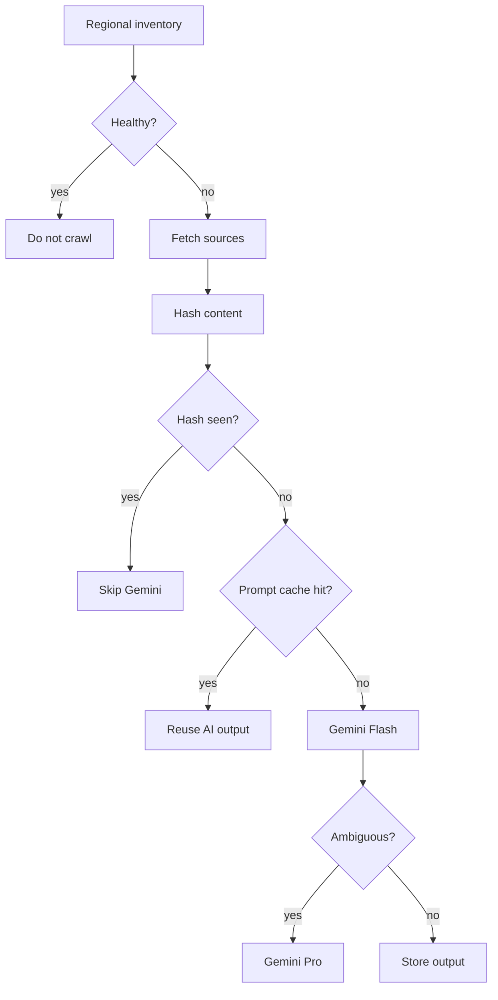

# Cost Optimization

## Core Rule

Process content once and serve the result many times.

## Controls

## Estimated Costs

Actual pricing depends on vendor plan and token/page sizes. The implemented controls reduce cost drivers:

- Firecrawl cost scales with scheduled source refreshes, not user traffic.
- Gemini cost scales with new or changed content hashes, not user traffic.
- Flash should handle most extraction/classification calls.
- Pro should be rare and limited to low-confidence verification.

For a small Atlanta pilot with 100 pages per run and 4 maximum discovery runs per day, the hard cap is 400 Firecrawl pages per day before vendor-side limits. Gemini calls should be lower than Firecrawl pages when content hashes and prompt cache hits are working.

