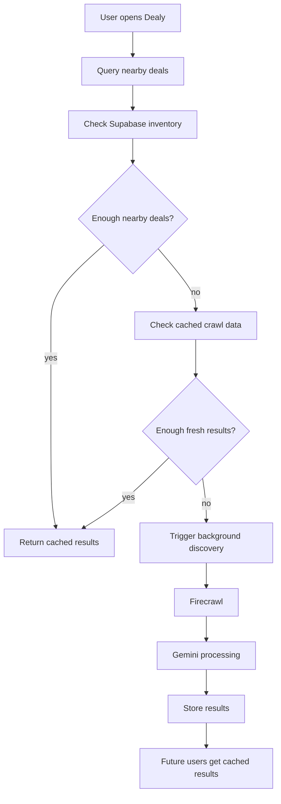

# Discovery Architecture

## Cache-First User Flow

## Pipeline

```mermaid
flowchart LR
  Sources[Source Discovery] --> Crawl[Firecrawl Extraction]
  Crawl --> Normalize[Content Normalization]
  Normalize --> Dedupe[Duplicate Detection]
  Dedupe --> Classify[Gemini Classification]
  Classify --> Score[Confidence Scoring]
  Score --> Verify[Verification]
  Verify --> Storage[Storage]
  Storage --> Ranking[Ranking]
```

## Regional Inventories

Inventories are shared buckets such as Atlanta, Georgia State, Georgia Tech, KSU, and UGA. The schema supports metro, campus, state, region, and national buckets through `region_type` and `region_slug`; Atlanta is not hardcoded.

Each inventory tracks:

- `deal_count`
- `last_refresh`
- `crawl_health`
- `verification_rate`

