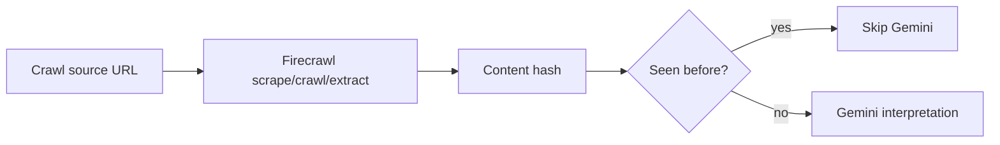

# Firecrawl Setup

## Environment

Set these backend-only variables:

```env
FIRECRAWL_API_KEY=
FIRECRAWL_MAX_PAGES_PER_RUN=100
FIRECRAWL_MAX_CONCURRENCY=5
FIRECRAWL_TIMEOUT_MS=30000
CRAWLER_ENABLED=true
```

Do not put Firecrawl keys in the iOS app.

## Runtime Role

Firecrawl discovers and extracts web content. It does not classify deals and it does not run per user request.



## Supported Operations

- `scrape`: one known URL, markdown-first extraction.
- `crawl`: source expansion within page limits.
- `extract`: structured extraction when Firecrawl is the right tool for source-side extraction.

## Cost Controls

- `FIRECRAWL_MAX_PAGES_PER_RUN` caps discovery fanout.
- `FIRECRAWL_MAX_CONCURRENCY` avoids bursty spend and rate-limit failures.
- Region trigger logic prevents healthy inventories from being recrawled.
- Content hashes prevent repeated Gemini calls for unchanged pages.

