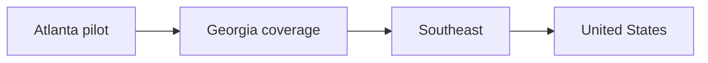

# Future Scaling

## Region Strategy

The foundation uses region abstractions instead of Atlanta-specific logic:

- `metro`: Atlanta
- `campus`: Georgia State, Georgia Tech, KSU, UGA
- `state`: Georgia
- `multi_state`: Southeast
- `national`: United States

## Scaling Path

## Operational Scaling

- Add sources per region, not per user.
- Refresh stale regions first.
- Prioritize regions below `MIN_LOCAL_DEALS`.
- Track cost per discovered deal.
- Keep Gemini Pro reserved for exception paths.
- Promote high-health regions to longer refresh intervals.

## Bottlenecks To Watch

- Crawl source quality and duplicate source pages.
- Geocoding accuracy for local merchants.
- Gemini token volume from noisy page content.
- Moderation load for low-confidence candidates.
- Search/index freshness after bulk discovery runs.

