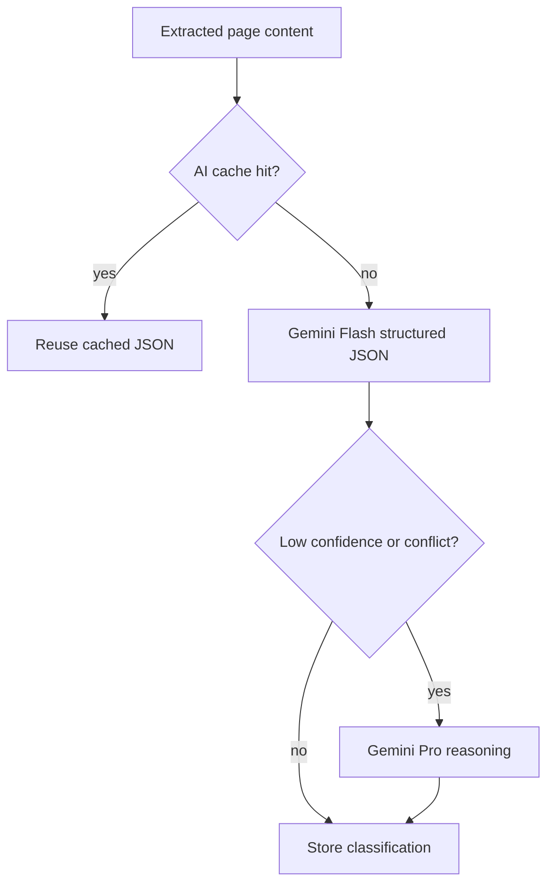

# Gemini Setup

## Environment

Set these backend-only variables:

```env
GOOGLE_GEMINI_API_KEY=
GEMINI_MODEL=gemini-2.5-flash
GEMINI_REASONING_MODEL=gemini-2.5-pro
AI_CACHE_TTL_HOURS=24
AI_ENABLED=true
```

## Runtime Role

Gemini interprets extracted content. It does not discover sources and it should not receive full websites when extracted page text is enough.



## Structured Outputs

Gemini responses are constrained to JSON for:

- deal extraction
- deal classification
- merchant normalization
- duplicate detection
- confidence scoring
- user-facing summaries
- verification reasoning

## Model Selection

Use `GEMINI_MODEL` for default work. Use `GEMINI_REASONING_MODEL` only when confidence is low, source evidence conflicts, or verification needs heavier reasoning.

